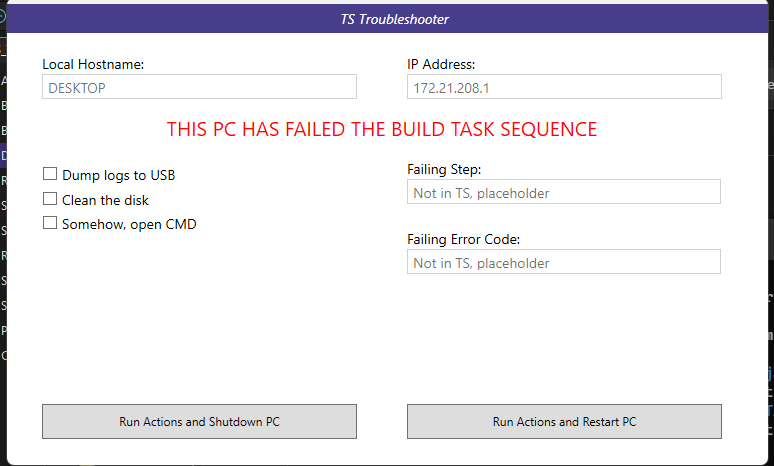
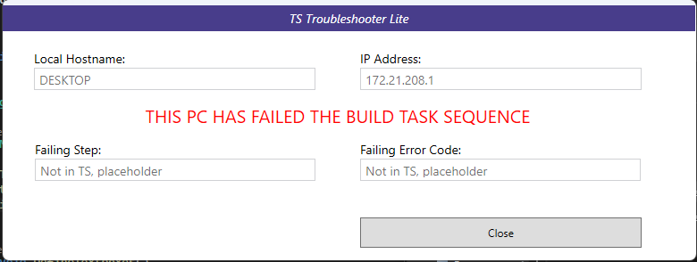

# TS Troubleshooter #

-------------------

Since F8 is not a great thing to have enabled within Task Sequences, I made an app to run on failure state that gives users the ability to do their own basic troubleshooting.

This is TS Troubleshooter



When it launches, it grabs the local hostname of the Windows instance.<br>
If this is in WindowsPE, this will be a 'minint-' name, to assist in identifing the offending PC in MCM logs.<br>
It will also display the current IP address.

Next, it will load avaliable option from a defined xml file.<br>
In the screenshot, dumping logs to a USB and cleaning the disk are defined.


When the app is run, it will populate each item in the XML as a selectable option.<br>
You pick what options you want run, then hit if you want the machine to shut down, or restart.<br>
The idea being you can build a troubleshooting task sequence, that will only run the selected steps.


If running in a test, outside of a task sequence, pressing 'shut down' or 'restart', will get this instead of a power off.<br>


### XML Format 

This is the format of the XML file (case sensitivity does not matter)<br>
```
<?xml version="1.0" encoding="utf-8" ?>
<options>
	<task TSV="Dump_USB">Dump logs to USB</task>
	<task TSV="Clean_Disk">Clean the disk</task>
</options>
```

By default, the app will look for config.xml in the same directory it is run from.
Otherwise you can define it in an argument. Either a website or file share will work.<br>
```
TS_Troubleshooter.exe http://coolwebsite/config.xml
```
or
```
TS_Troubleshooter.exe C:\Temp\this.xml
```
or
```
TS_Troubleshooter.exe \\fileshare\folder1\bing.xml
```
It'll throw an error if it can't find or access the file specified.

When run outside a Task Sequence, it will throw a pop-up with what variable would be saved if it was in a TS.<br>

<br>
<br>
<br>
If you don't feel like having an .XML with options etc, you can also use the lite version to just show hostname, IP, what failed and what code it spat out.<br>


-------------------

## TS_Troubleshooter_Unified

`TS_Troubleshooter_Unified` is a third build that merges the two above into one executable and
fixes a batch of bugs along the way. The original `TS_Troubleshooter` and `TS_Troubleshooter_Lite`
projects are untouched and still build.

Lite mode is not a separate build any more - it is the same window with no options to show. If a
config file is found you get the full screen; if there isn't one you get the lite screen.


Lite mode is informational only, so **Close** is its only button. Shutting the machine down or
restarting it is an action, and actions belong with the config file that describes them - those
two buttons only appear when there is a config.


Both screenshots are from a test run outside a task sequence, which is why the failure fields read
"Not in a task sequence" - inside one they carry the failing step name and its return code. The
hostname and IP have been replaced with placeholders.

```
TS_Troubleshooter.exe                              full screen using config.xml beside the exe
TS_Troubleshooter.exe -lite                        lite screen, config file ignored
TS_Troubleshooter.exe C:\Temp\this.xml             as before
TS_Troubleshooter.exe \\fileshare\folder1\bing.xml as before
TS_Troubleshooter.exe http://coolwebsite/config.xml  as before
```

Deploying it is a single file copy - dropping the WMI lookup for the hostname removed the
`System.Management` reference, so there are no NuGet DLLs to carry into the boot image.

### Download

Prebuilt binaries are on the [releases page](https://github.com/iron-jay/TS_Troubleshooter/releases):

| File | Use it for |
| --- | --- |
| `TS_Troubleshooter-x86.exe` | x86 boot images, and x64 boot images too if you want one binary everywhere |
| `TS_Troubleshooter-x64.exe` | x64 boot images and the full OS phase |

Both need .NET Framework 4.7.2, so a WinPE boot image needs the NetFx optional component added.
`config.xml` is optional - without one the app starts in lite mode.

### What changed

**Bugs fixed**

* `config.xml` was marked as a WPF `Resource`, so it was compiled into the exe and never written
  next to it - a clean build produced an exe that immediately said "Unable to find config file".
* Passing two or more arguments showed an error box and then fell out of startup without exiting,
  leaving the splash screen up and the process alive forever. In a task sequence that hung the build.
* The relaunch dropped the original command line, so a config path or URL was silently lost the
  moment the session handoff happened.
* The session handoff used `CreateProcess`, which always creates the child in the caller's session.
  In a full-OS task sequence that meant the child landed back in session 0 and spawned another
  child, forever. It now uses `WTSQueryUserToken` + `CreateProcessAsUser` and actually crosses the
  session boundary, with a `--relaunched` guard so it can never happen more than once.
* `CreateProcess` was declared without `SetLastError`, passed `lpCommandLine` as an immutable
  string, and did not quote the exe path, so any install path containing a space was mis-parsed.
* If the target process was missing the app threw an unhandled exception - which is what happened
  on any bare WinPE test run, because WinPE has no `explorer.exe`. It now falls back to running in
  the current session.
* A `<task>` with no `TSV` attribute crashed with a `NullReferenceException`. Config problems now
  name the offending entry and, for malformed XML, the line and column.
* `XmlDocument.Load(url)` had no timeout, so a half-connected network left the app hanging with no
  way out. Downloads now have a 20 second timeout, TLS 1.2, and DTD/entity resolution turned off.
* There was no global exception handler, so anything unexpected produced the WPF crash dialog.

**Task sequence integration**

* Falls back to MECM's own `_SMSTSLastActionName` and `_SMSTSLastActionRetCode` when `failstep` and
  `failcode` are empty, so the failure details are populated without a custom error handler.
* Shows the return code in hex as well as decimal - `-2147024894  (0x80070002)` - because every
  lookup table is keyed on the hex form.
* Writes `TSTS_Action` (`Restart`, `Shutdown` or `Close`) so the sequence can branch on what the
  user chose. The existing `PE_Reboot` / `OS_Reboot` / `PE_Shutdown` / `OS_Shutdown` variables are
  set exactly as before.
* Unticked options are explicitly set to `False` rather than left alone, so a second pass through
  the screen cannot inherit a stale `True` from the first.
* Logs to `%TEMP%\TS_Troubleshooter.log` and, inside a task sequence, to `_SMSTSLogPath` so it is
  collected alongside `smsts.log`. The log records the task sequence name, deployment ID, target
  machine name, phase, hostname, every IP address, the failure details and what the user chose -
  there is no "copy to clipboard" button, because inside a task sequence there is nowhere to paste
  to. The log is the copy that can actually be retrieved.
* Exit codes: `0` normal, `1` config problem, `2` unhandled error, `3` bad command line. Everything
  the user can legitimately do exits `0`, since a non-zero exit fails the step.

**Interface**

* Detail fields are read-only instead of disabled. The originals disabled them, which greys the
  text out and makes it harder to read off the screen - which is the only way anyone reads it in
  WinPE.
* Centred, topmost, DPI-aware. The old window was fixed at 775x475 with hardcoded pixel margins and
  opened in the top-left corner of the screen.
* The option list scrolls. The old one was pinned to `Height="237"`, so past about eight entries the
  extra checkboxes rendered off-panel and were silently unclickable.
* Access keys, tab order and a sensible default focus, because a missing USB or NIC driver is
  exactly the sort of failure that lands someone on this screen with no working mouse.
* IP selection prefers the interface that has a default gateway and sorts APIPA addresses last. The
  old code displayed whichever address came last, very often a Hyper-V `vEthernet` address.
* All colours, fonts and control styles live in one `Resources/Styles.xaml`, so the two layouts
  cannot drift apart the way the originals had.

### Nothing dismisses the screen on its own

There is deliberately no timeout and no automatic action. The point of this screen is to hold a
failed build until somebody looks at it - if a task sequence fails at 7pm on a Friday the error
still has to be on the screen on Monday morning. It only ever closes when a person presses a button.

### Extra config options

The original config format still works unchanged. The only addition is an optional banner override.

```xml
<options>
    <message>THIS PC HAS FAILED THE BUILD TASK SEQUENCE</message>
    <task TSV="Dump_USB">Dump logs to USB</task>
    <task TSV="Clean_Disk">Clean the disk</task>
</options>
```

* `<message>` - replaces the red banner text. In lite mode the `TSTS_Message` task sequence
  variable does the same job.
