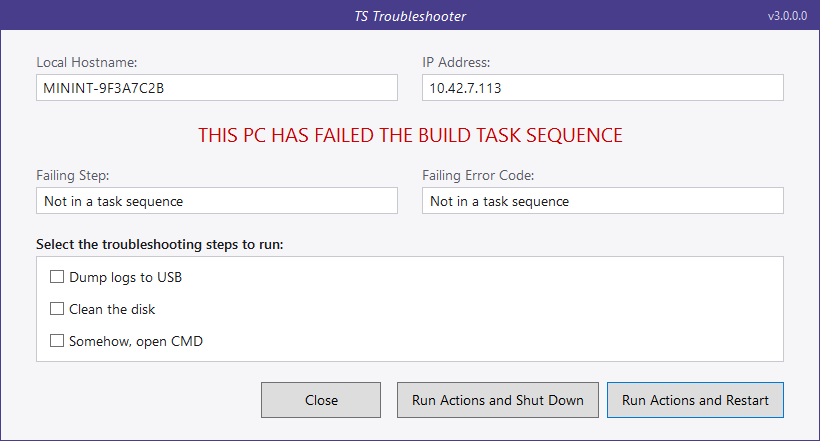
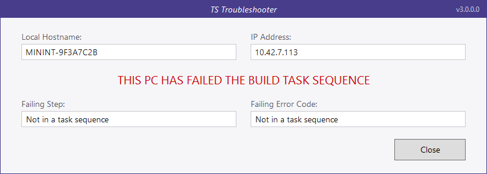
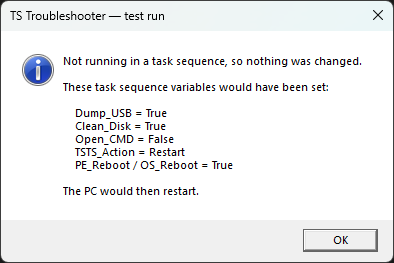

# TS Troubleshooter #

-------------------

Since F8 is not a great thing to have enabled within Task Sequences, I made an app to run on
failure state that gives users the ability to do their own basic troubleshooting.

This is TS Troubleshooter.



When it launches it grabs the local hostname of the Windows instance. In WinPE that will be a
'minint-' name, which helps identify the offending PC in MCM logs. It also shows the current IP
address, the step that failed and the code it returned.

Then it loads the available options from a defined XML file and shows each one as a tickbox. You
pick the options you want, then choose whether the machine should shut down or restart. The idea is
that you build a troubleshooting task sequence which only runs the steps that were selected.


### Lite mode

If you don't want an XML with options in it, run the app without a config file. You get the same
screen with the options removed - just hostname, IP, what failed and what code it spat out.



Lite mode is informational, so **Close** is its only button. Shutting the machine down or restarting
it is an action, and actions belong with the config file that describes them, so those two buttons
only appear when there is a config to drive them.

Both screenshots above are from a test run outside a task sequence, which is why the failure fields
read "Not in a task sequence" - inside one they carry the failing step name and its return code. The
hostname and IP have been replaced with placeholders.

-------------------

## Download

Prebuilt binaries are on the [releases page](https://github.com/iron-jay/TS_Troubleshooter/releases):

| File | Use it for |
| --- | --- |
| `TS_Troubleshooter-x86.exe` | x86 boot images, and x64 boot images too if you want one binary everywhere |
| `TS_Troubleshooter-x64.exe` | x64 boot images and the full OS phase |

It is a single file copy - there are no DLLs to carry alongside it into a boot image. Both builds
need .NET Framework 4.7.2, so a WinPE boot image needs the NetFx optional component added.

## Running it

```
TS_Troubleshooter.exe                                 config.xml beside the exe, or lite mode if absent
TS_Troubleshooter.exe -lite                           lite mode, config file ignored
TS_Troubleshooter.exe C:\Temp\this.xml                local path
TS_Troubleshooter.exe \\fileshare\folder1\bing.xml    file share
TS_Troubleshooter.exe http://coolwebsite/config.xml   web server
```

By default the app looks for `config.xml` in the directory it was run from. If it isn't there, the
app starts in lite mode. If you name a config file explicitly and it cannot be found, downloaded or
parsed, you get an error saying exactly what was wrong and the app exits with code `1`.

## XML format

Case does not matter on element or attribute names.

```xml
<?xml version="1.0" encoding="utf-8" ?>
<options>
    <message>THIS PC HAS FAILED THE BUILD TASK SEQUENCE</message>
    <task TSV="Dump_USB">Dump logs to USB</task>
    <task TSV="Clean_Disk">Clean the disk</task>
</options>
```


* `<task>` - one tickbox. The text is the label, `TSV` is the task sequence variable it sets.
* `<message>` - optional. Replaces the red banner text, so you can put your own wording there. In
  lite mode the `TSTS_Message` task sequence variable does the same job.

A file containing nothing but `<options></options>` is valid and gives you the lite screen.

## Task sequence variables

**Read.** The failing step and error code come from `failstep` and `failcode` if you populate them
yourself. If they are empty the app falls back to MECM's own `_SMSTSLastActionName` and
`_SMSTSLastActionRetCode`, which MECM sets automatically - so the failure details appear without you
having to wire up a custom error handler. The return code is shown in hex as well as decimal
(`-2147024894  (0x80070002)`), since every lookup table is keyed on the hex form.

**Written.** Each ticked option sets its `TSV` variable to `True`; every unticked one is explicitly
set to `False`, so a second pass through the screen cannot inherit a stale `True` from the first.
Alongside those:

| Variable | Set to |
| --- | --- |
| `TSTS_Action` | `Restart`, `Shutdown` or `Close` - what the user chose |
| `PE_Reboot` / `OS_Reboot` | `True` on restart, depending on whether you are in WinPE |
| `PE_Shutdown` / `OS_Shutdown` | `True` on shutdown, depending on whether you are in WinPE |

## Testing outside a task sequence

Run it on any machine and it will tell you what it would have done instead of touching anything.



## Logging

The app writes to `%TEMP%\TS_Troubleshooter.log`, and inside a task sequence also to
`_SMSTSLogPath`, so it is collected alongside `smsts.log`. The log records the task sequence name,
deployment ID, target machine name, phase, hostname, every IP address, the failure details and what
the user chose.

There is no "copy to clipboard" button, because inside a task sequence there is nowhere to paste to.
The log is the copy that can actually be retrieved.

## Nothing dismisses the screen on its own

There is deliberately no timeout and no automatic action. The point of this screen is to hold a
failed build until somebody looks at it - if a task sequence fails at 7pm on a Friday, the error
still has to be on the screen on Monday morning. It only ever closes when a person presses a button.

## Exit codes

| Code | Meaning |
| --- | --- |
| `0` | Normal. Every button the user can press exits `0`, since a non-zero exit fails the step |
| `1` | The config file could not be found, downloaded or parsed |
| `2` | An unhandled error. Details are in the log |
| `3` | Bad command line |

-------------------

## Notes on this build

The current app lives in `TS_Troubleshooter_Unified`. It merges what used to be two separate
executables - the full build and a Lite build - into one, so lite mode is now just the same window
with the options removed rather than a second project to keep in step.

Notable fixes over the older builds:

* `config.xml` was marked as a WPF `Resource`, so it was compiled into the exe and never written
  next to it - a clean build produced an exe that immediately said "Unable to find config file".
* Passing two or more arguments showed an error box and then fell out of startup without exiting,
  leaving the splash screen up and the process alive forever. In a task sequence that hung the build.
* The session relaunch dropped the original command line, so a config path or URL was silently lost
  the moment the handoff happened.
* The session handoff used `CreateProcess`, which always creates the child in the caller's session.
  In a full-OS task sequence the child landed back in session 0 and spawned another child, forever.
  It now uses `WTSQueryUserToken` + `CreateProcessAsUser` and actually crosses the session boundary,
  with a guard so it can never relaunch more than once.
* If the target process was missing the app threw an unhandled exception - which is what happened on
  any bare WinPE run, because WinPE has no `explorer.exe`. It now stays in the current session.
* A `<task>` with no `TSV` attribute crashed with a `NullReferenceException`. Config problems now
  name the offending entry and, for malformed XML, the line and column.
* `XmlDocument.Load(url)` had no timeout, so a half-connected network left the app hanging with no
  way out. Downloads now have a 20 second timeout, TLS 1.2, and DTD/entity resolution turned off.
* There was no global exception handler, so anything unexpected produced the WPF crash dialog.
* The option list scrolls. The old one was a fixed height, so past about eight entries the extra
  tickboxes rendered off-panel and were silently unclickable.
* The window is centred, topmost and DPI-aware. The old one was a fixed 775x475 with hardcoded pixel
  margins and opened in the top-left corner of the screen.
* Detail fields are read-only rather than disabled, so the text keeps full contrast - reading it off
  the screen is the only way anyone gets it in WinPE.
* Access keys, tab order and a sensible default focus, because a missing USB or NIC driver is exactly
  the sort of failure that lands someone on this screen with no working mouse.
* IP selection prefers the interface that has a default gateway and sorts APIPA addresses last. The
  old code displayed whichever address happened to come last, very often a Hyper-V `vEthernet` one.
* Dropping a WMI lookup for the hostname removed the `System.Management` reference, and with it
  `System.CodeDom`, so the build output is a single self-contained exe.

The two original projects, `TS_Troubleshooter` and `TS_Troubleshooter_Lite`, are still in the repo
and still build, but the fixes above are only in the unified build.
